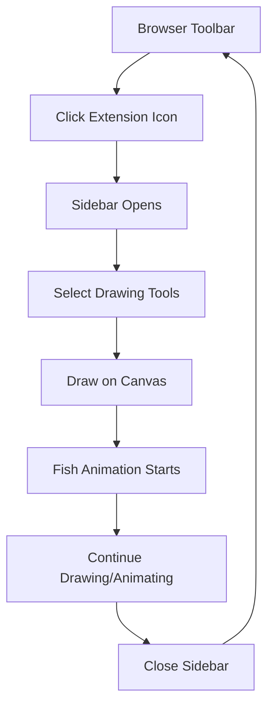

# Pretend to Slack Off - Browser Extension Product Requirements

## 1. Product Overview
A browser extension that provides a creative drawing canvas disguised as a productivity tool, allowing users to draw and animate fish while appearing to work.
- Solves the problem of workplace boredom by providing a discreet creative outlet that looks professional from a distance.
- Target users are office workers, students, and remote employees who need brief mental breaks during work hours.
- Creates value by improving mental well-being and creativity while maintaining professional appearance.

## 2. Core Features

### 2.1 User Roles
No role distinction is necessary for this extension - all users have the same access and functionality.

### 2.2 Feature Module
Our browser extension consists of the following main components:
1. **Browser Action**: Extension icon in browser toolbar that triggers sidebar opening.
2. **Sidebar Interface**: Main drawing area titled "Pretend to Slack Off" with canvas and tools.
3. **Drawing Canvas**: Interactive white canvas for creating illustrations.
4. **Tool Palette**: Color selection and brush customization controls.
5. **Animation Engine**: Automatic fish movement system with natural motion patterns.

### 2.3 Page Details

| Page Name | Module Name | Feature description |
|-----------|-------------|---------------------|
| Browser Toolbar | Extension Icon | Click to instantly open/close sidebar, visual indicator of extension status |
| Sidebar Interface | Header Section | Display "Pretend to Slack Off" title, minimize/close controls |
| Sidebar Interface | Drawing Canvas | White background canvas supporting mouse/touch drawing, clear canvas option |
| Sidebar Interface | Color Palette | Multiple color selection (red, blue, green, yellow, black, etc.), active color indicator |
| Sidebar Interface | Brush Tools | Brush size adjustment (small, medium, large), brush opacity controls |
| Sidebar Interface | Animation System | Automatic fish movement (horizontal left-right, vertical up-down), seamless looping, natural motion physics |

## 3. Core Process

**Main User Flow:**
1. User clicks extension icon in browser toolbar
2. Sidebar opens immediately on the right side of current webpage
3. User selects desired color from palette
4. User adjusts brush size and opacity as needed
5. User draws fish or other illustrations on white canvas
6. Drawn fish automatically begin animated movement across canvas
7. User can continue drawing while animations run continuously
8. User clicks extension icon again to close sidebar when finished

## 4. User Interface Design

### 4.1 Design Style
- **Primary Colors**: Clean white background (#FFFFFF), professional blue accent (#2196F3)
- **Secondary Colors**: Soft gray borders (#E0E0E0), subtle shadows (#00000020)
- **Button Style**: Rounded corners (4px radius), flat design with hover effects
- **Font**: System default sans-serif, 14px for main text, 16px for title
- **Layout Style**: Vertical sidebar layout, card-based tool sections, minimal padding
- **Icons**: Simple line icons for tools, fish emoji (🐟) for branding

### 4.2 Page Design Overview

| Page Name | Module Name | UI Elements |
|-----------|-------------|-------------|
| Browser Toolbar | Extension Icon | 16x16px fish icon, blue background when active, tooltip "Pretend to Slack Off" |
| Sidebar Interface | Header | White background, blue title text "Pretend to Slack Off", close button (×) |
| Sidebar Interface | Canvas Area | 300px width, full height white canvas, thin gray border, smooth drawing strokes |
| Sidebar Interface | Color Palette | Horizontal row of 8 color circles, 24px diameter, selected state with border |
| Sidebar Interface | Brush Tools | Slider for size (1-20px), opacity slider (10-100%), real-time preview dot |
| Sidebar Interface | Animation Controls | Auto-start animations, speed indicator, pause/play toggle (optional) |

### 4.3 Responsiveness
Desktop-first design optimized for browser sidebar usage. Fixed 320px width sidebar that adapts to browser height. Touch interaction support for drawing on touch-enabled devices.