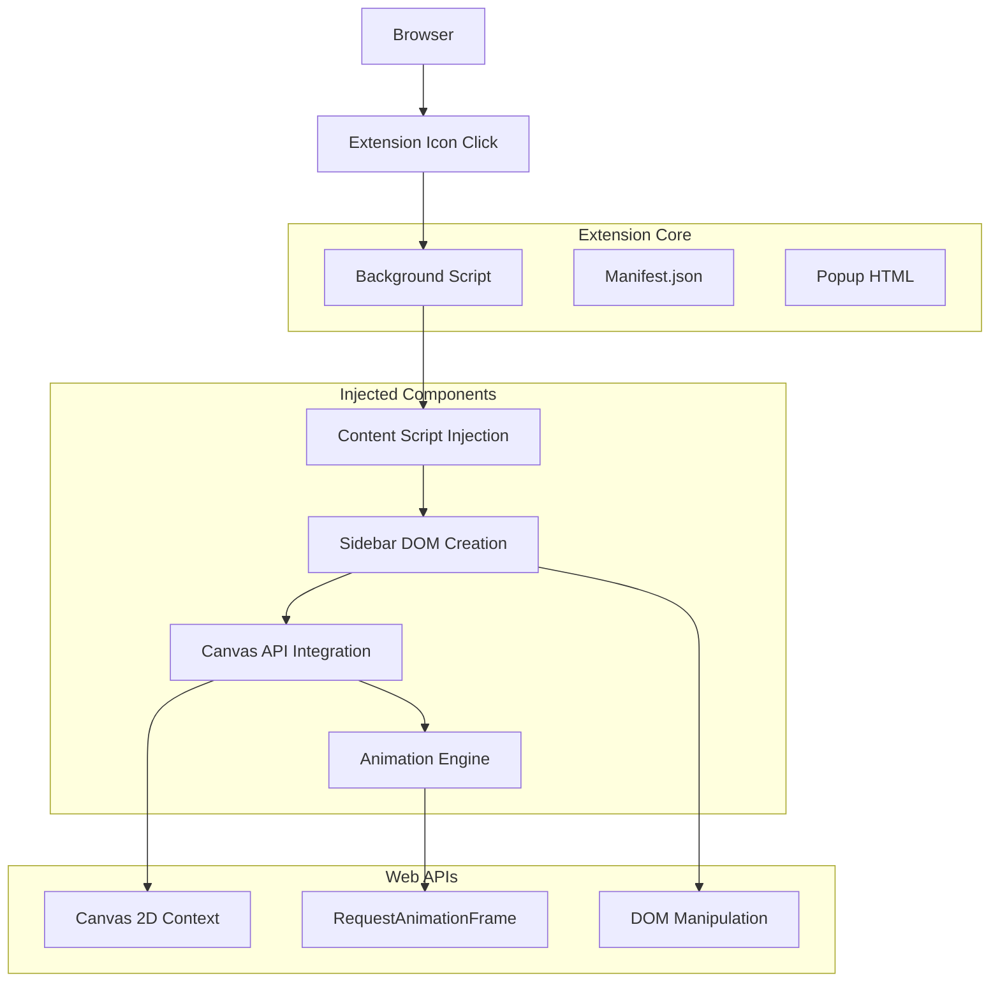
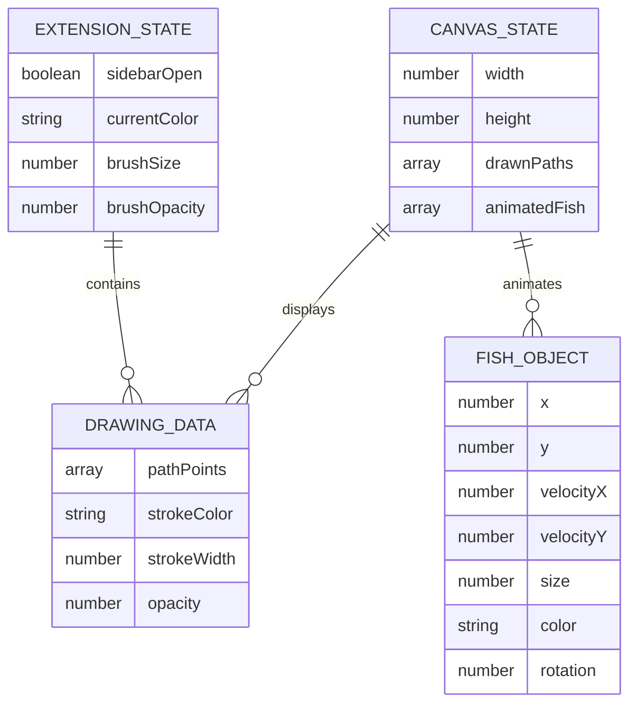

# Pretend to Slack Off - Technical Architecture Document

## 1. Architecture Design



## 2. Technology Description

* Frontend: Vanilla JavaScript (ES6+) + HTML5 Canvas + CSS3

* Extension Framework: Chrome Extension Manifest V3

* Animation: RequestAnimationFrame API + Canvas 2D Context

* Storage: Chrome Extension Storage API (optional for settings)

## 3. File Structure

| File Path          | Purpose                                                    |
| ------------------ | ---------------------------------------------------------- |
| /manifest.json     | Extension configuration and permissions                    |
| /background.js     | Service worker for extension lifecycle                     |
| /content.js        | Injected script for sidebar creation and canvas management |
| /sidebar.html      | Sidebar template structure                                 |
| /sidebar.css       | Sidebar styling and animations                             |
| /canvas.js         | Drawing functionality and tool management                  |
| /animation.js      | Fish movement and animation logic                          |
| /icons/icon16.png  | 16x16 toolbar icon                                         |
| /icons/icon48.png  | 48x48 extension management icon                            |
| /icons/icon128.png | 128x128 Chrome Web Store icon                              |

## 4. API Definitions

### 4.1 Core Extension APIs

**Extension Activation**

```javascript
// Background Script - Action Click Handler
chrome.action.onClicked.addListener((tab) => {
  chrome.tabs.sendMessage(tab.id, {action: 'toggleSidebar'});
});
```

**Content Script Communication**

```javascript
// Content Script - Message Listener
chrome.runtime.onMessage.addListener((request, sender, sendResponse) => {
  if (request.action === 'toggleSidebar') {
    toggleSidebar();
    sendResponse({status: 'success'});
  }
});
```

### 4.2 Canvas Drawing API

**Drawing Functions**

```javascript
// Canvas Drawing Interface
class DrawingCanvas {
  constructor(canvasElement) {
    this.canvas = canvasElement;
    this.ctx = canvasElement.getContext('2d');
    this.isDrawing = false;
    this.currentColor = '#000000';
    this.brushSize = 5;
  }
  
  startDrawing(x, y) {
    this.isDrawing = true;
    this.ctx.beginPath();
    this.ctx.moveTo(x, y);
  }
  
  draw(x, y) {
    if (!this.isDrawing) return;
    this.ctx.lineTo(x, y);
    this.ctx.stroke();
  }
  
  stopDrawing() {
    this.isDrawing = false;
  }
}
```

### 4.3 Animation API

**Fish Animation System**

```javascript
// Animation Controller
class FishAnimator {
  constructor(canvas) {
    this.canvas = canvas;
    this.fish = [];
    this.animationId = null;
  }
  
  addFish(x, y, size) {
    this.fish.push({
      x: x,
      y: y,
      size: size,
      velocityX: (Math.random() - 0.5) * 2,
      velocityY: (Math.random() - 0.5) * 2
    });
  }
  
  animate() {
    this.updateFishPositions();
    this.renderFish();
    this.animationId = requestAnimationFrame(() => this.animate());
  }
}
```

## 5. Server Architecture

No server-side components required. This is a client-side only browser extension that operates entirely within the user's browser environment.

## 6. Data Model

### 6.1 Data Structure Definition



### 6.2 Local Storage Schema

**Extension Settings Storage**

```javascript
// Chrome Extension Storage
const defaultSettings = {
  sidebarWidth: 320,
  defaultBrushSize: 5,
  defaultColor: '#000000',
  animationSpeed: 1.0,
  autoStartAnimation: true
};

// Save settings
chrome.storage.local.set({settings: defaultSettings});

// Load settings
chrome.storage.local.get(['settings'], (result) => {
  const settings = result.settings || defaultSettings;
});
```

**Canvas Data Structure**

```javascript
// In-memory canvas state
const canvasState = {
  paths: [
    {
      points: [{x: 100, y: 100}, {x: 150, y: 120}],
      color: '#FF0000',
      width: 5,
      opacity: 1.0
    }
  ],
  fish: [
    {
      x: 200,
      y: 150,
      velocityX: 1.5,
      velocityY: 0.8,
      size: 20,
      color: '#FFA500',
      rotation: 0
    }
  ],
  canvasSize: {
    width: 300,
    height: 600
  }
};
```

