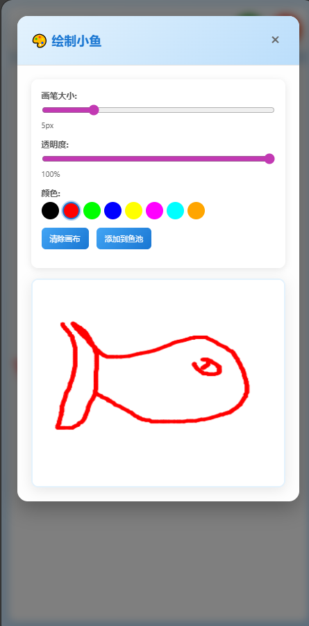
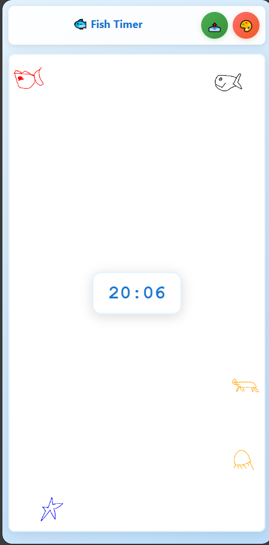

# 专心摸鱼 - Browser Extension

将浏览器变成鱼缸，在番茄钟模式下专心摸鱼。

<div align="center">
  
</div>


## 功能特性

- 🎨 **绘图功能**: 完整的画布绘图工具
- 🐟 **鱼类动画**: 3条鱼在画布上自然游动
- ⏰ **专注时钟**: 内置番茄工作法计时器，帮助你保持专注

## 安装方法

### Chrome/Edge 浏览器

1. 打开浏览器，进入扩展管理页面:
   - Chrome: `chrome://extensions/`
   - Edge: `edge://extensions/`

2. 开启「开发者模式」

3. 点击「加载已解压的扩展程序」

4. 选择本项目文件夹 

5. 扩展安装完成！

## 使用方法

1. 点击浏览器工具栏中的鱼形图标
2. 侧边栏将从右侧滑出
3. 使用绘图工具在画布上作画
4. 观看可爱的鱼儿在画布上游动
5. 再次点击图标或点击关闭按钮隐藏侧边栏

## 文件结构

```
├── manifest.json          # 扩展配置文件
├── background.js          # 后台脚本
├── content.js            # 内容脚本
├── sidebar.css           # 侧边栏样式
├── canvas.js             # 绘图功能
├── animation.js          # 鱼类动画
└── icons/                # 扩展图标
    ├── icon16.svg
    ├── icon48.svg
    └── icon128.svg
```

## 技术特性

- **Manifest V3**: 使用最新的扩展API
- **响应式设计**: 适配不同屏幕尺寸
- **现代化UI**: 渐变背景和流畅动画
- **触摸支持**: 支持移动设备触摸绘图
- **性能优化**: 高效的动画渲染

## 兼容性

- ✅ Chrome 88+
- ✅ Edge 88+
- ✅ 其他基于 Chromium 的浏览器

## 注意事项

- 扩展无法在浏览器系统页面 (chrome://, edge://) 中运行
- 绘图内容会自动保存到本地存储
- 动画使用 requestAnimationFrame 确保流畅性能

## 开发说明

本扩展使用纯 JavaScript 开发，无需额外依赖。主要技术栈:

- **Canvas API**: 绘图和动画渲染
- **Chrome Extension API**: 扩展功能实现
- **CSS3**: 现代化样式和动画
- **ES6+**: 现代 JavaScript 语法

---

享受你的摸鱼时光！🐟

